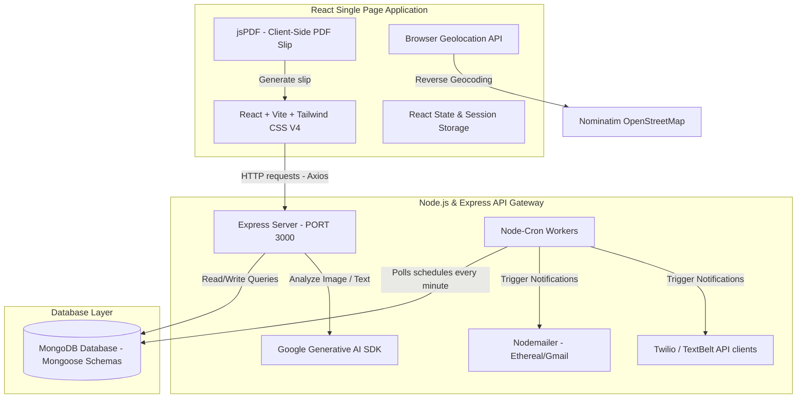

# 🩺 Arogya AI Healthcare Ecosystem

[](https://react.dev/)
[](https://nodejs.org/)
[](https://www.mongodb.com/)
[](https://deepmind.google/technologies/gemini/)

**Arogya** (meaning *health* or *freedom from disease*) is a comprehensive, full-stack wellness and medical management ecosystem that merges modern generative AI with daily healthcare utilities. It bridges the gap between complex medical documents and patient understanding, automates medication adherence, facilitates doctor-patient matching, and monitors mental wellness.

---

## 🚀 Key Features

### 1. 💊 AI Prescription & Lab Analyzer
* **Multimodal Scan:** Upload photos of handwritten/printed prescriptions or medical lab reports (JPG, PNG, PDF).
* **AI translation:** Powered by `gemini-2.5-flash` to extract a detailed summary, diagnosis, warnings, specific medication dosages, and lab value interpretations (e.g., hemoglobin status) in user-friendly English.

### 2. 🧠 AI Symptom Checker & Health Reports
* **Smart Analysis:** Describe symptoms in natural language.
* **Segmented Insights:** Receives a structured report detailing normal expectations, warning red flags, safe home remedies, and professional doctor advice.

### 3. 🗓️ Location-Aware Doctor Search & Slot Booking
* **Auto-Location Detection:** Autocompletes user location utilizing reverse-geocoding via the OpenStreetMap API.
* **Real-time Calendar Booking:** Checks doctor weekly schedules and booked dates to prevent double booking.
* **Client-side PDF Slips:** Instantly generate and download verified PDF appointment tickets using `jsPDF`.

### 4. ⏰ Automated Medication Reminders (Cron Service)
* **Precise Notifications:** Background workers schedule checks every minute.
* **Dual-channel Alerts:** Dispatches real-time medication alerts via Twilio SMS (with TextBelt fallback) and Nodemailer (Gmail/mock developer mailbox).

### 5. ❤️ Mental Wellness Engine & Journaling
* **Daily Check-ins:** Track mood, energy levels, stress factors, and sleep quality.
* **Virtual Psychologist:** Receives empathetic AI-driven feedback, advice, and a calculated distress risk score.

---

## 🛠️ Tech Stack & Architecture



* **Frontend:** React 19, Vite, Tailwind CSS V4, Axios, jsPDF, Framer Motion.
* **Backend:** Node.js, Express.js.
* **Database:** MongoDB (using Mongoose schemas).
* **AI Models:** Google Gemini APIs (`gemini-2.5-flash` & `gemini-flash-latest`).
* **Services:** Twilio, TextBelt, Nodemailer SMTP.

---

## 📥 Installation & Setup

### Prerequisites
* Node.js (v18+)
* MongoDB (Local or Atlas URI)
* Google Gemini API Key
* Twilio API credentials (optional for live SMS)
* Gmail SMTP App Password (optional for live Emails)

### 1. Clone & Setup Backend
1. Navigate to the backend directory:
   ```bash
   cd backend
   ```
2. Install dependencies:
   ```bash
   npm install
   ```
3. Create a `.env` file in the `backend/` directory:
   ```env
   PORT=3000
   MONGODB_URI=mongodb://127.0.0.1:27017/arogya
   GEMINI_API_KEY=your_gemini_api_key_here
   
   # Optional: For Live Email
   EMAIL_USER=your_gmail@gmail.com
   EMAIL_PASS=your_gmail_app_password
   
   # Optional: For Twilio SMS
   TWILIO_API_KEY=your_twilio_api_key
   TWILIO_API_SECRET=your_twilio_secret
   TWILIO_ACCOUNT_SID=your_account_sid
   TWILIO_PHONE_NUMBER=your_twilio_phone
   ```
4. Start the backend server:
   ```bash
   # Development Mode (runs nodemon)
   npm run dev
   
   # Production Mode
   npm start
   ```

### 2. Setup Frontend
1. Navigate to the frontend directory:
   ```bash
   cd ../frontend
   ```
2. Install dependencies:
   ```bash
   npm install
   ```
3. Start the development server:
   ```bash
   npm run dev
   ```
4. Open the browser at the local address displayed (e.g. `http://localhost:5173/`).

---

## 🔌 API Reference

### User Authentication & Management
* `POST /api/users/signup` - Register a new patient. (Triggers welcome SMS).
* `POST /api/users/login` - Authenticate user credentials. (Triggers security email & SMS alert).
* `PUT /api/users/:id` - Update user bio metrics (age, height, weight, mood trackers).

### Healthcare Utilities
* `GET /api/doctors` - Find doctors matching specialization and city location parameters. (Seeds mock records if none match).
* `POST /api/appointments` - Book slot with a doctor. (Saves slot, sets date unavailable, dispatches email & SMS).
* `GET /api/appointments/:userId` - Retrieve booking history for a specific patient.

### Generative AI Endpoints
* `POST /api/chat` - Empathetic chat with Arogya AI Assistant (identifies risk thresholds and recommends specializations).
* `POST /api/reports` - Creates a symptom report (categorized normal/risk/remedies/doctor advice).
* `POST /api/prescriptions` - Multimodal image/PDF upload. Analyzes prescription OCR, returns medical information.
* `POST /api/wellness-checkin` - Save mood log and journal, returns Dr. Arogya's psychological feedback text.

### Admin Panel
* `POST /api/admin/login` - Authenticate admin users.
* `GET /api/admin/doctors` - Fetch full registration roster of doctors.
* `POST /api/admin/doctors` - Register a new doctor.
* `PUT /api/admin/doctors/:id` - Edit doctor coordinates, contact, and availability.
* `DELETE /api/admin/doctors/:id` - Revoke doctor credentials from the portal database.
* `GET /api/admin/appointments` - Global list of appointments.
* `PUT /api/appointments/:id/status` - Mark scheduled appointments as completed.

---

## 🔒 Security & Medical Disclaimer

### Safety Notice
**Arogya AI Healthcare** is an AI-powered advisor designed for educational and organization support. It does not constitute real medical diagnostics, clinical prescriptions, or healthcare treatment programs. Users should always consult qualified healthcare professionals before changing medication programs or acting on recommendations.

### Security Status
* For demonstration purposes, password credentials are stored as clear text.
* Session states are persisted client-side in standard sessionStorage.
* Production ready iterations should implement:
  * Password hashing (`bcrypt`).
  * Stateless token authorization (`JWT`).
  * HTTPS SSL protocols.
